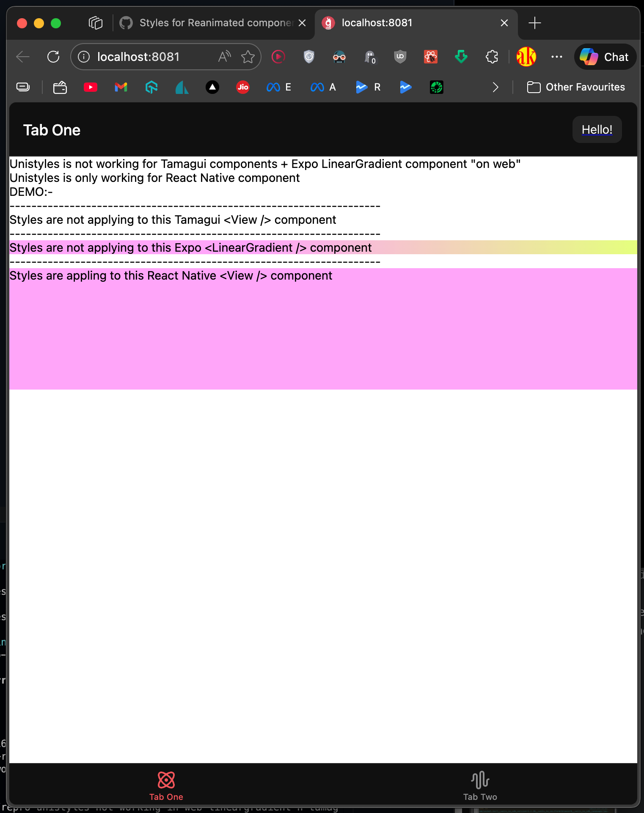
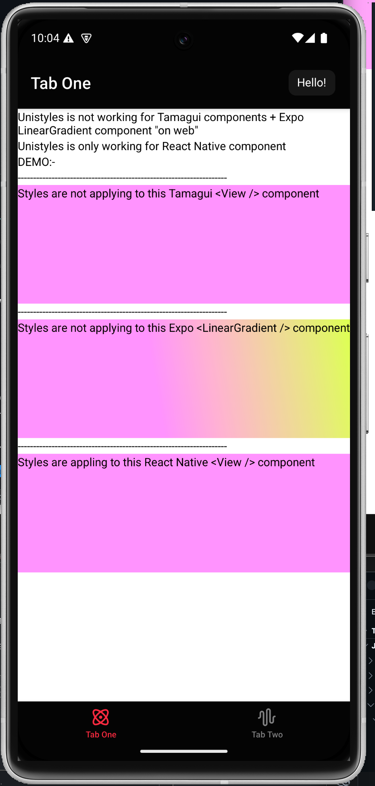

# unistyles-web-styling-issue

Unistyles styling does not work on the web for **Expo `LinearGradient`** and **Tamagui** components, while the same code works correctly on native platforms.

## Demo Screenshots

### 1. Web (Not Working)

Unistyles styles are **not applied** to Expo `LinearGradient` and Tamagui components on the web.

### 2. Android (Working)

The same components and styles work **as expected** on the Android emulator.

